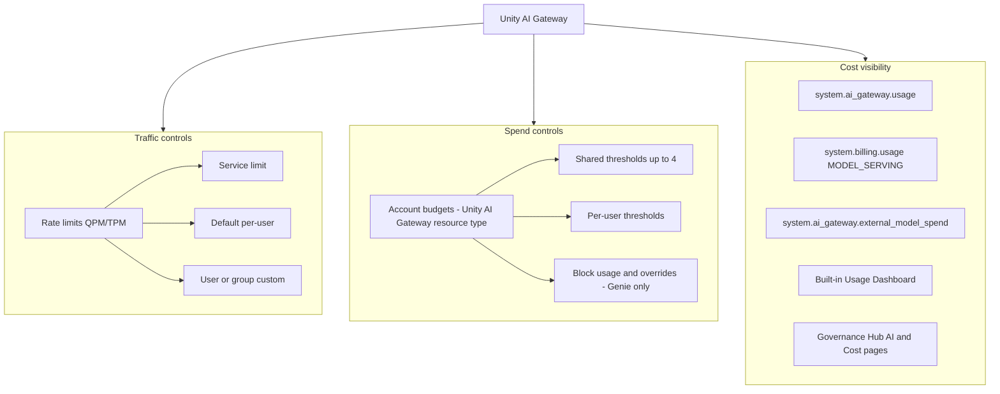

# AI Gateway Cost Visibility & Thresholding — Prior Art Brief

**Compiled:** 2026-07-26  
**Scope:** Unity AI Gateway (current) + legacy Mosaic/Agent Bricks AI Gateway + serving-endpoint AI Gateway  
**Purpose:** Catalog existing Databricks prior art for cost visibility, thresholding, and spend management to inform gateway API/product work.

---

## Executive summary

Databricks treats **Unity AI Gateway** as the central AI traffic control plane. Cost governance splits into three layers:

1. **Visibility** — system tables (`system.ai_gateway.usage`, `system.billing.usage`, `system.ai_gateway.external_model_spend`), built-in Usage Dashboard (Cost Observability tab), Governance Hub Cost/AI pages, inference tables.
2. **Soft dollar thresholds** — account **Budgets** with resource type `Unity AI Gateway`: shared + per-user monthly thresholds, email alerts, workspace/tag scoping.
3. **Hard controls** — **rate limits** (QPM/TPM, HTTP 429) for all Gateway traffic; **usage blocking** + per-user overrides only on **Genie** budgets today.

**Key gap:** Blogs market hard spend caps for all Unity AI Gateway traffic; docs restrict **Block usage** and **per-user overrides** to Genie. Budgets also exclude provisioned throughput and external-model inference even though visibility tables cover external estimated spend.

**Internal search status:** Glean, Slack, and Confluence MCP calls failed with `403 Invalid Token` (UC OAuth tokens expired). Re-auth required before internal PRDs, design docs, Aha!, and Slack threads can be incorporated.

---

## Internal search blocker

| Connection | UC state | Token expiry | Login URL |
|---|---|---|---|
| glean-mcp | ACTIVE | 2026-07-06 | [Glean MCP](https://adb-2548836972759138.18.azuredatabricks.net/explore/connections/glean-mcp?o=2548836972759138) |
| slack | ACTIVE | 2026-07-08 | [Slack](https://adb-2548836972759138.18.azuredatabricks.net/explore/connections/slack?o=2548836972759138) |
| confluence-mcp | ACTIVE | 2026-04-07 | [Confluence](https://adb-2548836972759138.18.azuredatabricks.net/explore/connections/confluence-mcp?o=2548836972759138) |

After browser OAuth, re-run Glean queries: `"AI spend controls"`, `Unity AI Gateway budgets`, `per-user threshold`, PRD/design doc, Aha ideas; Slack `#ai-gateway` and related channels.

---

## Architecture: observe vs control



---

## Layer 1 — Cost visibility (observe)

### System tables

| Table | Doc | Granularity | Key fields / use |
|---|---|---|---|
| `system.ai_gateway.usage` | [Usage tracking](https://docs.databricks.com/aws/en/ai-gateway/usage-tracking) | Per request | Tokens, latency, requester, `endpoint_tags`, `request_tags`, routing/fallbacks; account-admin `SELECT` only |
| `system.billing.usage` (`MODEL_SERVING`) | [Cost observability](https://docs.databricks.com/aws/en/ai-gateway/cost-observability) | Billing records | `usage_metadata.ai_gateway.{endpoint_name,endpoint_id,destination_model,destination_id}`, `identity_metadata.run_by`, `custom_tags` (DBU) |
| `system.ai_gateway.external_model_spend` | Same | Hourly USD aggregates | Estimated external provider spend from published prices; by provider, model, requester, tags |
| `system.serving.endpoint_usage` | [Configure AI Gateway on endpoints](https://docs.databricks.com/aws/en/ai-gateway/configure-ai-gateway-endpoints) | Legacy serving path | Token counts per endpoint; `usage_context` map for end-user chargeback |
| Inference tables | [Inference tables](https://docs.databricks.com/aws/en/ai-gateway/) | Payload-level | Full request/response for audit, debugging, evaluation corpus |

### Attribution mechanisms

- **Endpoint tags** — set at model service creation; propagate to `system.billing.usage.custom_tags`; used for budget scoping (`team`, `cost_center`, `project`).
- **Request tags** — `Databricks-Ai-Gateway-Request-Tags` HTTP header (JSON map); logged to `request_tags` in usage and external spend tables.
- **Identity** — `identity_metadata.run_by` / `requester` for user vs service principal attribution.

### UI / dashboards

| Surface | Access | Content |
|---|---|---|
| Built-in Usage Dashboard | Unity AI Gateway → Govern → Create/View Usage Dashboard | Overview, Performance, Usage, **Cost Observability** (v0.4+), External MCP, Coding Agents; 6h auto-refresh from v0.3 |
| Governance Hub | Account/workspace admin | AI page: budget status + spend summary; Cost page: consolidated spend drivers (Beta) |
| Account console | Account admin | Usage → Budgets: per-budget charts, per-user spend table (under / approaching / exceeded) |

### Visibility limitations (documented)

- Non-streaming, non-embedding responses **>1 MiB** — token usage not tracked.
- External spend is **informational** (published list prices); may not match provider invoices.
- **Custom provider** external spend not estimated.
- `system.billing.usage` refreshes every few hours; budget enforcement uses near-real-time path (numbers can diverge from system tables).
- Inference tables cap max concurrency at **128** per endpoint when enabled.

---

## Layer 2 — Thresholding & management (control)

### A. Rate limits (capacity proxy, not dollars)

**Doc:** [Configure rate limits](https://docs.databricks.com/aws/en/ai-gateway/rate-limits)

| Dimension | Model services | MCP services |
|---|---|---|
| Limits | QPM + TPM | QPM only |
| Levels | Service-wide, default per-user, custom user/SP or group | Same (QPM) |
| Enforcement | HTTP 429; post-response accounting → burst overshoot possible | Same |
| Caps | Max 20 limits/service; max 5 group limits/service | Same |

Rate limits are independent of dollar budgets. Use for runaway retry loops and capacity protection.

### B. Unity AI Gateway budgets (dollar thresholds)

**Docs:**
- [Manage budgets for Unity AI Gateway](https://docs.databricks.com/aws/en/ai-gateway/budgets)
- [Create and monitor budgets](https://docs.databricks.com/aws/en/admin/account-settings/budgets)
- [Budgets API](https://docs.databricks.com/api/account/budgets) (Public Preview, `billing` scope)

#### Configuration (console)

1. Account console → **Usage** → **Budgets** → Add budget
2. **Resource type** = `Unity AI Gateway` (or include in account-wide budget)
3. Optional **workspace** filter
4. Optional **resource tags** (matched to endpoint tags)
5. **Shared thresholds** (≤4 unique monthly amounts) + optional **per-user threshold**
6. **Actions:** `Send alert` (email); `Block usage` — **Genie budgets only**

#### What budgets track

| Included | Excluded |
|---|---|
| Pay-per-token (PAYGO) | Provisioned throughput |
| `ai_query` batch inference | External-model inference |

#### Enforcement behavior

- Near-real-time spend tracking for Gateway/Genie (not tied to system-table lag).
- List-price USD; no credits or negotiated discounts.
- Soft overshoot when blocking: in-flight requests complete; brief enforcement delay.
- Max **1,000 budgets/account**; max **20 per-user overrides** (Genie).

#### Programmatic management (Budgets API)

```
POST /api/2.1/accounts/{account_id}/budgets
```

Key fields: `display_name`, `filter` (workspace + tags), `alert_configurations[]` with:
- `trigger_type`: `CUMULATIVE_SPENDING_EXCEEDED`
- `quantity_threshold`, `quantity_type`: `LIST_PRICE_DOLLARS_USD`
- `time_period`: `MONTH`
- `action_configurations[]`: `EMAIL_NOTIFICATION` + target email

**Gap for API builders:** Public API docs show single `alert_configurations` entry per budget; console supports up to 4 shared thresholds + per-user threshold. Genie-specific controls (block, overrides) may not be fully exposed via API yet — verify against latest API schema before building automation.

### C. Genie — reference implementation for hard caps

**Doc:** [Genie budgets](https://docs.databricks.com/aws/en/genie/budgets)

- Tag: `databricks-product: genie` (no other tags)
- Shared pool + per-user threshold + per-user overrides
- **Block usage** on shared or per-user threshold
- Free monthly allowance exists outside budgets
- Shared and per-user thresholds evaluated **independently** (first block wins)

Copy this pattern for general AI Gateway hard spend caps.

---

## Layer 3 — Historical & adjacent prior art

| Era | Source | Cost capabilities |
|---|---|---|
| **Unity AI Gateway (2026)** | [AI governance](https://docs.databricks.com/aws/en/ai-gateway/), [What's new blog](https://www.databricks.com/blog/whats-new-unity-ai-gateway-service-policies-guardrails-observability-and-cost-controls-ai) | Unified control plane: rate limits, budgets, usage tables, external spend, Governance Hub |
| **AI Spend Controls launch** | [Introducing AI spend controls](https://www.databricks.com/blog/introducing-ai-spend-controls-unity-ai-gateway) | Per-user/workspace/use-case/account budgets; markets hard caps; Cost Analytics dashboard |
| **Mosaic / Agent Bricks** | [Security & governance blog](https://www.databricks.com/blog/new-updates-mosaic-ai-gateway-bring-security-and-governance-genai-models) | `system.serving.endpoint_usage` + inference tables; rate limits; no dollar budgets |
| **Serving-endpoint AI Gateway** | [Configure on endpoints](https://docs.databricks.com/aws/en/ai-gateway/configure-ai-gateway-endpoints) | Workspace-level QPM/TPM, usage tracking, `usage_context` chargeback |
| **Account cost platform** | [Cost management](https://docs.databricks.com/aws/en/admin/usage) | `system.billing.usage`, tags, serverless overspend protection, general budgets framework |
| **Community** | [Model Serving cost & latency](https://community.databricks.com/t5/technical-blog/databricks-ai-model-serving-in-production-scaling-cost-and/ba-p/161043) | Gateway as governance layer; production cost/latency tradeoffs |

### Product messaging vs shipped behavior

| Claim (blogs/marketing) | Current docs reality |
|---|---|
| Hard spend caps stop all Unity AI Gateway requests | **Block usage** only on Genie budgets |
| Per-user overrides for power users | **Genie only** |
| Budgets cover external providers | Visibility yes (`external_model_spend`); **budgets exclude** external inference |
| "Hard budget limits" in What's New blog | Alerts for general Gateway; blocking is Genie-scoped in docs |

---

## Recommended operating pattern

1. **Tag everything** — endpoint tags (`team`, `cost_center`, `use_case`) + request tags for chargeback.
2. **Layer controls** — account ceiling budget + workspace budgets + tag-scoped use-case budgets + per-user experimentation alerts.
3. **Pair dollars with traffic** — budget alerts + service/user rate limits for loop protection.
4. **Operate from two surfaces** — Governance Hub for admins; SQL on `system.billing.usage` / `external_model_spend` for FinOps.
5. **Genie separately** — use Genie budget pattern (block + overrides) as the enforcement template.
6. **Reconcile sources** — budget emails, budget UI, and system tables update at different rates; use budget UI for threshold status, system tables for analysis.

---

## Product gaps & roadmap candidates (for gateway API work)

| Gap | Impact | Prior art to extend |
|---|---|---|
| Hard **Block usage** for non-Genie Gateway | Customers expect blog-promised caps | Genie budget enforcement engine |
| Budget coverage for **external-model** and **provisioned throughput** inference | Visibility/control mismatch | `external_model_spend` + `MODEL_SERVING` billing enrichment |
| **Per-user overrides** for general Gateway | Power-user / team lead budgets | Genie override model |
| **Budgets API** parity with console (4 thresholds, per-user, block) | Automation / IaC | [Budgets API](https://docs.databricks.com/api/account/budgets/create) |
| **Real-time threshold API** for apps/agents | Programmatic spend checks before dispatch | Rate limit 429 pattern; budget enforcement backend |
| Unified **gateway API** surface for cost policy CRUD | Empty `gateway api` workspace target | Budgets API + model service rate limit config APIs |
| Alert channels beyond email | Ops integration | Budget `action_configurations` (today: `EMAIL_NOTIFICATION` only in API sample) |

---

## SQL quick reference

### DBU cost by model service (30d)

```sql
SELECT
  usage_metadata.ai_gateway.endpoint_name AS endpoint_name,
  SUM(usage_quantity) AS dbus
FROM system.billing.usage
WHERE billing_origin_product = 'MODEL_SERVING'
  AND usage_metadata.ai_gateway.endpoint_name IS NOT NULL
  AND usage_unit = 'DBU'
  AND usage_date >= current_date() - INTERVAL 30 DAYS
GROUP BY endpoint_name
ORDER BY dbus DESC;
```

### External model spend by user (30d)

```sql
SELECT
  identity_metadata.run_by AS run_by,
  SUM(usage_quantity) AS usd
FROM system.ai_gateway.external_model_spend
WHERE usage_start_time >= current_timestamp() - INTERVAL 30 DAYS
GROUP BY run_by
ORDER BY usd DESC;
```

### Usage by request tag

```sql
SELECT
  request_tags['project'] AS project,
  COUNT(*) AS request_count,
  SUM(total_tokens) AS total_tokens
FROM system.ai_gateway.usage
WHERE request_tags['project'] IS NOT NULL
GROUP BY project
ORDER BY total_tokens DESC;
```

---

## Source bibliography

### Primary (docs.databricks.com)

- [AI governance with Unity AI Gateway](https://docs.databricks.com/aws/en/ai-gateway/)
- [AI governance guide](https://docs.databricks.com/aws/en/ai-gateway/ai-governance)
- [Manage budgets for Unity AI Gateway](https://docs.databricks.com/aws/en/ai-gateway/budgets)
- [Monitor Unity AI Gateway cost](https://docs.databricks.com/aws/en/ai-gateway/cost-observability)
- [Model usage / usage tracking](https://docs.databricks.com/aws/en/ai-gateway/usage-tracking)
- [Configure rate limits](https://docs.databricks.com/aws/en/ai-gateway/rate-limits)
- [Create and monitor budgets](https://docs.databricks.com/aws/en/admin/account-settings/budgets)
- [Manage Genie budgets](https://docs.databricks.com/aws/en/genie/budgets)
- [Cost management tools](https://docs.databricks.com/aws/en/admin/usage)
- [Configure AI Gateway on serving endpoints](https://docs.databricks.com/aws/en/ai-gateway/configure-ai-gateway-endpoints)
- [Budgets API](https://docs.databricks.com/api/account/budgets)

### Blogs & community

- [Introducing AI spend controls with Unity AI Gateway](https://www.databricks.com/blog/introducing-ai-spend-controls-unity-ai-gateway)
- [What's new: service policies, guardrails, observability, cost controls](https://www.databricks.com/blog/whats-new-unity-ai-gateway-service-policies-guardrails-observability-and-cost-controls-ai)
- [Mosaic AI Gateway security & governance](https://www.databricks.com/blog/new-updates-mosaic-ai-gateway-bring-security-and-governance-genai-models)
- [Model Serving in production: cost & latency](https://community.databricks.com/t5/technical-blog/databricks-ai-model-serving-in-production-scaling-cost-and/ba-p/161043)

### Third-party summary

- [Unity AI Gateway budgets guide (Data Today)](https://data-today.net/databricks/databricks-ai-gateway-budgets/) — GA timing, tag propagation, API notes

---

## Next steps (after internal auth)

1. Re-auth Glean/Slack/Confluence via browser login URLs above.
2. Glean sweep for internal PRDs, eng design docs, Aha! ideas, ES tickets on spend controls.
3. Slack search in `#ai-gateway` and related channels for implementation details and PM owners.
4. Append internal findings section to this brief; validate blog-vs-docs gaps with PM/eng sources.
